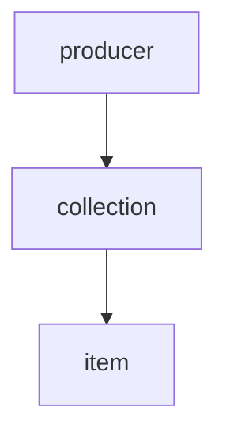

**producer** - Table representing the owners of collections.
uuid PRIMARY,
email string NOT NULL,
password string NOT NULL,
created_at timestamp NOT NULL (should have a trigger to set this when a row is created)

**collection** - Table representing an owner’s collection.
uuid PRIMARY KEY,
size int NOT NULL DEFAULT 0,
created_at timestamp NOT NULL (should have a trigger to set this when a row is created)
producer_id FOREIGN KEY references producer NOT NULL

**item** - Table representing an individual piece
collection_id FOREIGN KEY NOT NULL,
uuid string NOT NULL,
name string NOT NULL,
description string NULLABLE,
price int NOT NULL,
created_at timestamp NOT NULL (should have a trigger to set this when a row is created)
images JSONB not null DEFAULT "{}"
**

https://www.artmover.com/display/benito/fds324r230qnkjlnsdz




```sql
CREATE TABLE producer (
  uuid uuid PRIMARY KEY,
  email text NOT NULL,
  password text NOT NULL,
  created_at timestamp NOT NULL DEFAULT CURRENT_TIMESTAMP
);

CREATE TABLE collection (
  uuid uuid PRIMARY KEY,
  size int NOT NULL DEFAULT 0,
  created_at timestamp NOT NULL DEFAULT CURRENT_TIMESTAMP,
  producer_id uuid NOT NULL REFERENCES producer(uuid)
);

CREATE TABLE item (
  collection_id uuid NOT NULL REFERENCES collection(uuid),
  uuid uuid PRIMARY KEY,
  name text NOT NULL,
  description text,
  price int NOT NULL,
  created_at timestamp NOT NULL DEFAULT CURRENT_TIMESTAMP,
  images jsonb NOT NULL DEFAULT '{}'
);


```
dummy data:
```sql
CREATE EXTENSION IF NOT EXISTS "uuid-ossp";

INSERT INTO producer (uuid, email, password) VALUES
  (uuid_generate_v4(), 'john@example.com', 'password1'),
  (uuid_generate_v4(), 'jane@example.com', 'password2'),
  (uuid_generate_v4(), 'bob@example.com', 'password3');

INSERT INTO collection (uuid, size, producer_id) VALUES
  (uuid_generate_v4(), 10, (SELECT uuid FROM producer WHERE email = 'john@example.com')),
  (uuid_generate_v4(), 20, (SELECT uuid FROM producer WHERE email = 'jane@example.com')),
  (uuid_generate_v4(), 30, (SELECT uuid FROM producer WHERE email = 'bob@example.com'));

INSERT INTO item (collection_id, uuid, name, description, price, images) VALUES
  ((SELECT uuid FROM collection WHERE size = 10), uuid_generate_v4(), 'Item 1', 'Description for item 1', 100, '{"image1.jpg", "image2.jpg"}'),
  ((SELECT uuid FROM collection WHERE size = 10), uuid_generate_v4(), 'Item 2', 'Description for item 2', 200, '{"image3.jpg", "image4.jpg"}'),
  ((SELECT uuid FROM collection WHERE size = 20), uuid_generate_v4(), 'Item 3', 'Description for item 3', 300, '{"image5.jpg", "image6.jpg"}'),
  ((SELECT uuid FROM collection WHERE size = 20), uuid_generate_v4(), 'Item 4', 'Description for item 4', 400, '{"image7.jpg", "image8.jpg"}'),
  ((SELECT uuid FROM collection WHERE size = 30), uuid_generate_v4(), 'Item 5', 'Description for item 5', 500, '{"image9.jpg", "image10.jpg"}');

```